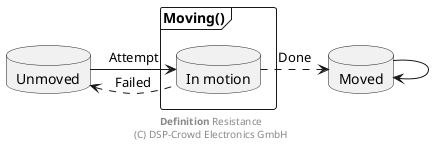

+++
date = '2026-03-18T23:02:35+01:00'
title = 'Welcome!'
author = 'Naegolus'
+++

This is our first blog post

```plantuml
@startuml

' skinparam linetype ortho

database "Unmoved" as sUn
database "Moved" as sMo

frame "Moving()" as pMove {
  database "In motion" as sIn
}

sUn -> sIn : Attempt
sUn <. sIn : Failed
sIn .> sMo : Done
sMo -> sMo

footer **Definition** Resistance\n(C) DSP-Crowd Electronics GmbH

@enduml
```

