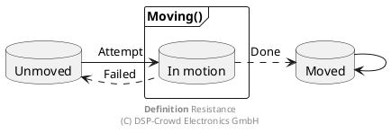

+++
date = '2026-03-31T12:24:47+02:00'
draft = true
title = 'What Is Resistance?'
+++

Einleitung. Das ist ein Text. Einleitung. Das ist ein Text. Einleitung. Das ist ein Text. Einleitung. Das ist ein Text. Einleitung. Das ist ein Text.
Einleitung. Das ist ein Text. Einleitung. Das ist ein Text. Einleitung. Das ist ein Text. Einleitung. Das ist ein Text. Einleitung. Das ist ein Text.

## Elektrischer Widerstand

$$
R_e = \rho \frac{l}{A}
$$

$$
\rho = \frac{m}{ne^2\tau}
$$

## Magnetischer Widerstand

$$
R_m = \frac{1}{\mu_0 \mu_r} \frac{l}{A}
$$

## Markov

$$
\hat{x}_s = \lim_{n \rightarrow \infty} A^n\hat{x}_0
$$

<!--
Literature
- https://de.wikipedia.org/wiki/Elektrischer_Widerstand
- https://de.wikipedia.org/wiki/Magnetischer_Widerstand
-->

